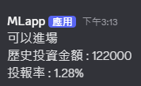

# ml基金機器人預測專案

## 主要目標客群
想投資的上班族、想增加退休金的退休人士

## 想解決的問題
投資者面對資訊過載、缺乏專業判斷與驗證機制，導致策略錯誤與焦慮。

目標系統需達成：

 - 利用 AI 預測資產淨值走勢。
 - 能即時驗證投資策略報酬。
 - 將策略結果推播至行動裝置（即時回饋）。

## 最小可行性產品(MVP)
### 功能預覽

step 1 使用者選定指定基金中的成分股與其預測賣出時間。
 
step 2 系統自動下載成分股歷史報價資料。

step 3 AI 模型預測未來趨勢 (淨值走勢)。

step 4 系統判斷是否可進場。

step 5 透過dc機器人推播給使用者，內容包含是否可進場和其策略現實執行的報酬率。

### 📸 實作畫面

## 📊 功能開發進度

- 預測 模組
  - &#10004; 資料擷取與預處理
  - &#10004; 模型訓練
  - &#10004; git action 部屬
  - - [ ] 預測內容加廣
- 推播與通知 模組
  - &#10004; discord機器人推播
- 使用者互動介面 模組
  - - [ ] 使用 gradio 介面化 
- 資料庫 模組
  - &#10004; 使用json檔紀錄虛擬買入的投報率

