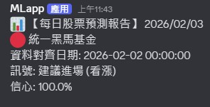

# 基金AI預測專案

## 主要目標客群

想透過 AI 輔助判斷基金買賣時機的投資人，特別適合：
- 想穩定增值但缺乏時間盯盤的上班族
- 希望降低投資決策焦慮的退休理財規劃者

## 想解決的問題

投資者在下單前，容易因市場資訊過載、自身缺乏專業判斷與驗證機制，以及受情緒干擾影響，最後做出錯誤的策略判斷，從而產生焦慮。

本專案透過以下服務，讓投資者遠離焦慮：

- 利用 AI 預測基金淨值未來漲跌趨勢
- 利用信心分數透明化 AI 決策結果
- 將策略結果即時推播至 Discord

## 最小可行性產品(MVP)

### 功能預覽

1. **資料爬取**：系統自動從台灣證交所下載目標基金 (統一黑馬基金) 之成分股 (世芯-KY、奇鋐、台積電) 歷史報價資料。
2. **資料對齊**：系統整合成分股資料與目標基金 (統一黑馬基金) 淨值資料。
3. **模型訓練**：使用 TCN (Temporal Convolutional Network) 訓練時序預測模型。
4. **訊號產生**：AI 模型判斷是否建議進場，並計算信心分數。
5. **推播通知**：透過 Discord 機器人推播預測結果給使用者。

### 📸 實作畫面

## 📊 功能開發進度

### 投資預測與策略系統
- 投資預測模組
  - &#10004; 資料爬取與預處理 (`scraper.py`)
  - &#10004; TCN 模型訓練 (`train_model.py`)
  - &#10004; 預測訊號產生 (`predict.py`)
  - &#10004; Git Action 自動化部署
  - - [ ] 資料來源加廣 (新聞、財報、分析師等)
  - - [ ] LLM 模型預測 (關鍵字分析、情緒分析等) 加權

### 使用者互動與介面系統
- 使用者互動介面模組
  - - [ ] 策略選擇 (勾選)
  - - [ ] 使用 Gradio 介面化
  - - [ ] 廣告位 (底部橫幅)
  - - [ ] 策略結果折線圖

### 資料庫維護與管理系統
- 資料庫模組
  - - [ ] 使用 JSON 檔紀錄虛擬買入的投報率
  - - [ ] 儲存使用者資料 (帳號、email、登入資訊、權限、點數餘額)
  - - [ ] 個人化策略紀錄
  - - [ ] 點數使用紀錄
  - - [ ] 簽到記錄
  - - [ ] 任務完成紀錄
  - - [ ] 廣告管理
  - - [ ] 系統公告
  - - [ ] 異常紀錄
  - - [ ] 報酬率排行榜 (計算、排名、發獎)
- 系統資源與推播模組
  - &#10004; Discord 機器人推播 (`notifier.py`)

### 點數與會員成長系統
- 點數獎勵模組
  - - [ ] 每日簽到功能
  - - [ ] 社群分享回報 API (分享至 X/Facebook)
  - - [ ] 點數消費與解鎖

